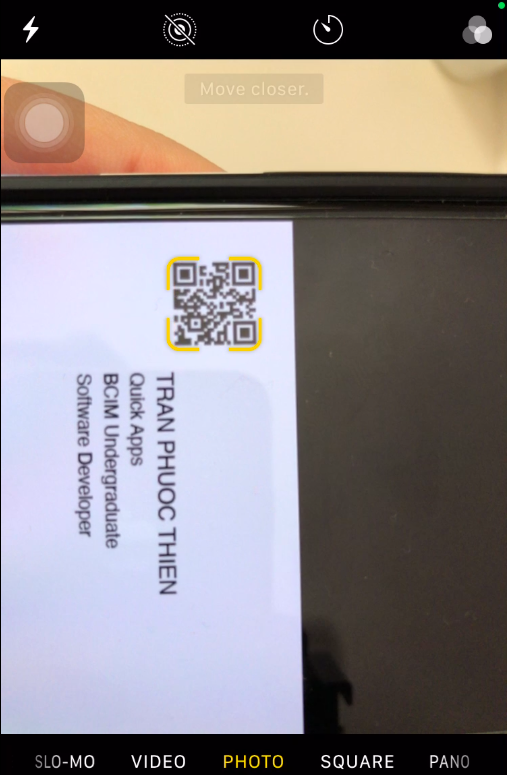

  

# Project: QuickBiz
  

    
  

QuickBiz is a smart card prototype that uses the latest QR technology for you to store any kind of information - whether it be websites, email addresses, text messages, events, contact information, or physical locations. You can customise the QR code in any shape or colours, and either a physical or a digital smart card. 

The technology is limitless and the opportunities are endless. You can literally turn your personalised smart card into anything you want, especially if you’ve got a business and are wanting to make a business card. If that’s you and you don’t want to print 500 business cards, or simply want a nicely custom designed physically or digitally printed card, then do consider reaching out to us.

## Got any inquries? [Drop me an Email](mailto:donnyquickinc@gmail.com)

#### Enjoying this repository? Kindly support me with some spare change, as I'm still a husttling university student!
    

PayPal is a registered trademark of PayPal, Inc. The PayPal logo is a trademark of PayPal, Inc.

